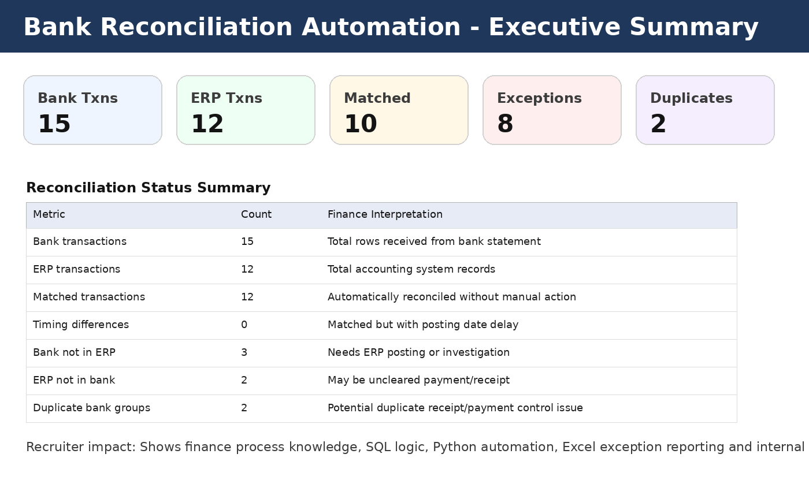
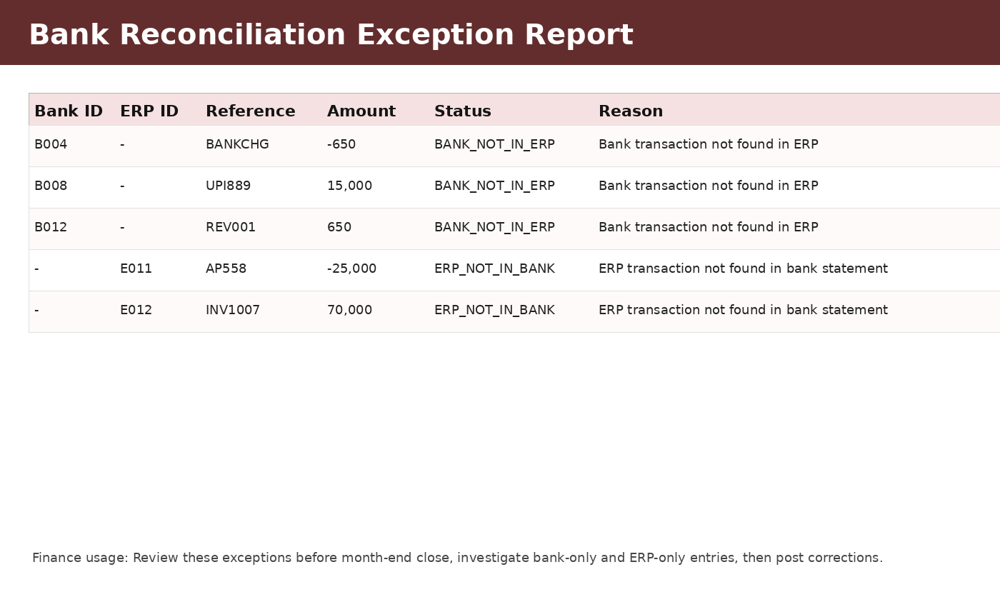
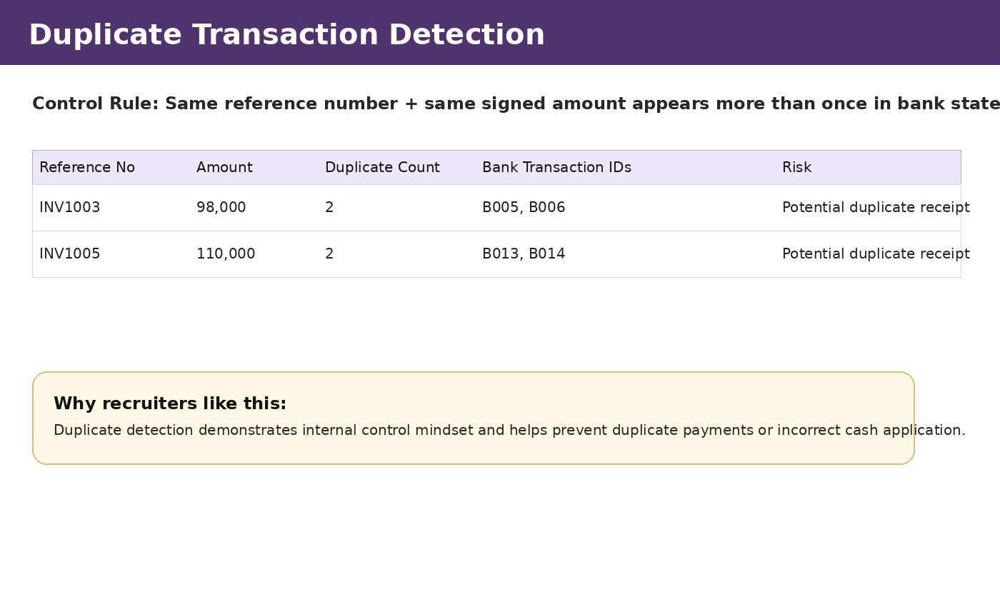
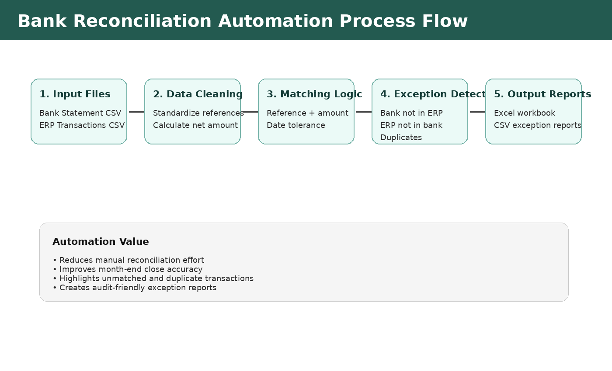

Bank Reconciliation Automation using SQL, Python and Excel
This project automates a common finance process: reconciling bank statement transactions against ERP transactions. It identifies matched transactions, unmatched bank items, unmatched ERP items, duplicate bank transactions, and timing differences.
Why This Project Matters
Bank reconciliation is performed regularly in accounting and finance teams. Recruiters value this project because it demonstrates practical skills in:
Finance operations
SQL reconciliation logic
Python automation
Excel reporting
Exception handling
Month-end close support
Internal controls
Business Problem
Finance teams receive bank statements and compare them with ERP/accounting system records. Manual reconciliation is slow and error-prone. Common issues include:
Bank transactions missing in ERP
ERP transactions not cleared in bank
Duplicate receipts or payments
Timing differences between bank date and ERP posting date
Bank charges and reversals
Project Objective
Build an automated reconciliation workflow that:
Loads bank statement and ERP transaction data
Standardizes transaction reference numbers and signed amounts
Matches transactions by reference number and amount
Flags timing differences
Detects unmatched transactions
Detects duplicate bank entries
Exports exception reports for finance review
Tools Used
Tool	Purpose
SQL / MySQL	Database tables, matching logic, exception views
Python	File-based automation and report generation
Pandas	Data cleaning, matching and exception logic
Excel	Final report review by finance users
CSV	Sample input datasets
Folder Structure
```text
bank-reconciliation-automation/
│
├── data/
│   ├── bank\\\_statement.csv
│   └── erp\\\_transactions.csv
│
├── sql/
│   ├── 01\\\_create\\\_tables.sql
│   ├── 02\\\_sample\\\_data.sql
│   └── 03\\\_reconciliation\\\_logic.sql
│
├── python/
│   └── bank\\\_reconciliation.py
│
├── outputs/
│   └── generated after running Python script
│
├── screenshots/
│   ├── 01\\\_dashboard\\\_summary.png
│   ├── 02\\\_exception\\\_report.png
│   ├── 03\\\_duplicate\\\_detection.png
│   └── 04\\\_process\\\_flow.png
│
├── docs/
│   ├── excel\\\_review\\\_guide.md
│   └── recruiter\\\_project\\\_summary.md
│
├── requirements.txt
└── README.md
```
Sample Input Data
Bank Statement
bank_txn_id	transaction_date	reference_no	debit	credit
B001	2026-05-01	INV1001	0	125000
B004	2026-05-04	BANKCHG	650	0
B006	2026-05-06	INV1003	0	98000
ERP Transactions
erp_txn_id	transaction_date	reference_no	debit	credit
E001	2026-05-01	INV1001	0	125000
E004	2026-05-05	INV1003	0	98000
E011	2026-05-16	AP558	25000	0
Matching Logic
The automation uses the following matching rules:
Rule	Description
Exact match	Same reference number and same signed amount
Timing difference	Same reference and amount but date difference greater than 1 day
Bank not in ERP	Transaction appears in bank but not ERP
ERP not in bank	Transaction appears in ERP but not bank
Duplicate bank transaction	Same reference and amount appears more than once in bank statement
Signed amount logic:
```text
Net Amount = Credit - Debit
```
Receipt/inflow = positive amount  
Payment/outflow = negative amount
SQL Setup
Run the SQL scripts in this order:
```sql
source sql/01\\\_create\\\_tables.sql;
source sql/02\\\_sample\\\_data.sql;
source sql/03\\\_reconciliation\\\_logic.sql;
```
Main SQL outputs:
```sql
SELECT \\\* FROM vw\\\_reconciliation\\\_summary;
SELECT \\\* FROM vw\\\_bank\\\_reconciliation\\\_exception\\\_report;
SELECT \\\* FROM vw\\\_duplicate\\\_bank\\\_transactions;
```
Python Setup
Install dependencies:
```bash
pip install -r requirements.txt
```
Run automation:
```bash
python python/bank\\\_reconciliation.py
```
Generated outputs:
```text
outputs/reconciliation\\\_summary.csv
outputs/matched\\\_transactions.csv
outputs/unmatched\\\_bank\\\_transactions.csv
outputs/unmatched\\\_erp\\\_transactions.csv
outputs/duplicate\\\_bank\\\_transactions.csv
outputs/bank\\\_reconciliation\\\_report.xlsx
```
Dashboard / Screenshot Preview
Reconciliation Summary

Exception Report

Duplicate Detection

Process Flow

Key Finance Insights
Bank charges were identified as bank-only transactions.
Certain ERP postings did not appear in bank data, indicating pending clearance or posting issues.
Duplicate customer receipts were flagged for review.
Timing differences were separated from true unmatched exceptions.
Recruiter-Friendly Resume Bullet
> Automated bank reconciliation using SQL and Python by matching bank statement and ERP transactions, identifying unmatched entries, duplicate transactions, and timing differences, and generating Excel exception reports for finance review.
Skills Demonstrated
Bank reconciliation process knowledge
SQL joins, views and exception reports
Python automation using Pandas
Excel reporting
Duplicate detection
Month-end close support
Internal control reporting
Possible Enhancements
Add Power BI dashboard
Connect Python to MySQL database
Automate email alerts using n8n or Outlook
Add fuzzy matching for descriptions
Schedule daily reconciliation using Windows Task Scheduler or cron
Add tolerance-based amount matching
